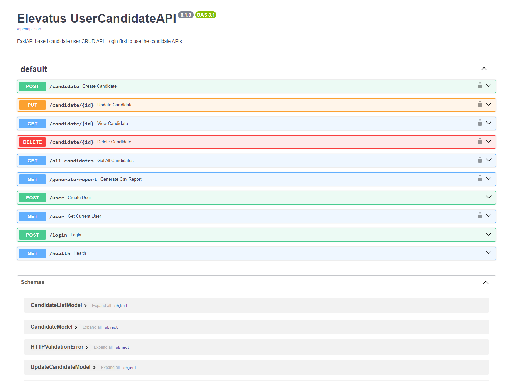

Recruit API
------------

This FastAPI application is designed to manage candidate profiles efficiently. The system allows users to create, view, update, and delete candidate profiles. It also supports searching for specific candidates and generating reports.

Check the Swagger Documentation live here: http://139.59.202.153/docs

Or Locally here after running docker-compose (See below): http://localhost:8181/docs

## Features

**Candidate Profile Management**: CRUD operations for candidate profiles.
**Search Functionality**: Advanced search options in candidate profiles.
**Report Generation**: Ability to export candidate data as CSV.
**User Authentication**: Secure access to candidate management endpoints.
**Health Check**: Endpoint for system status verification.

# Technology Stack
- FastAPI
- MongoDB
- PyDantic
- PyMongo
- Docker

Usage
------------

## Overview
This Docker configuration is designed for a FastAPI application with MongoDB as the database. It includes a development setup with a test database and a Mongo Express admin interface.

### Services
1. **mongo**: Main MongoDB database service.
2. **mongo-test**: Separate MongoDB instance for testing.
3. **mongo-express**: Web-based MongoDB admin interface.
4. **fastapi-test**: FastAPI application in test mode.
5. **fastapi**: Main FastAPI application service.

### Configuration Details

#### MongoDB Service (mongo)
- **Image**: `mongo:7.0.4`
- **Environment Variables**:
  - `MONGO_INITDB_ROOT_USERNAME`: Username for MongoDB root user.
  - `MONGO_INITDB_ROOT_PASSWORD`: Password for MongoDB root user.

#### MongoDB Test Service (mongo-test)
- **Ports**:
  - Maps port 89 on the host to 27017 in the container.
- **Environment Variables**:
  - `MONGO_INITDB_ROOT_USERNAME`: Username for test MongoDB root user.
  - `MONGO_INITDB_ROOT_PASSWORD`: Password for test MongoDB root user.

#### Mongo Express (mongo-express)
- **Image**: `mongo-express`
- **Ports**:
  - Maps port 8081 on the host to 8081 in the container.
- **Environment Variables**:
  - `ME_CONFIG_MONGODB_ADMINUSERNAME`: Username for Mongo Express admin.
  - `ME_CONFIG_MONGODB_ADMINPASSWORD`: Password for Mongo Express admin.
  - `ME_CONFIG_MONGODB_URL`: URL for connecting to the MongoDB service.

#### FastAPI Test Service (fastapi-test)
- **Build**: Builds the Docker image from the current directory.
- **Depends On**: Specifies dependency on `mongo-test`.
- **Command**: Runs unit tests for the application.
- **Volumes**:
  - Maps the current directory to `/app` in the container.

#### FastAPI Service (fastapi)
- **Build**: Builds the Docker image from the current directory.
- **Environment File**:
  - Loads environment variables from a `.env` file.
- **Depends On**: Specifies dependency on `mongo`.
- **Ports**:
  - Maps port 8181 on the host to 8000 in the container.
- **Volumes**:
  - Maps the current directory to `/app` in the container.

### Usage Instructions

1. **Starting Services**:
   - Run `docker-compose up` to start all services.
   - Access FastAPI at `localhost:8181`.
   - Access Mongo Express at `localhost:8081`.

2. **Running Tests**:
   - Use `docker-compose up fastapi-test` to execute the tests.

3. **Shutting Down**:
   - Run `docker-compose down` to stop and remove the containers.

### Note
- Ensure Docker and Docker Compose are installed on your system.
- Modify the `.env` file as needed for environment-specific configurations.
- For production deployment, remove or secure the Mongo Express service.
- 